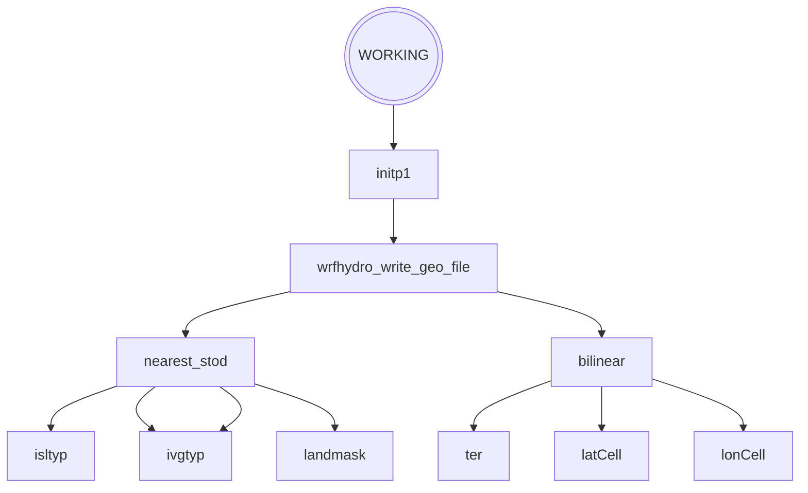
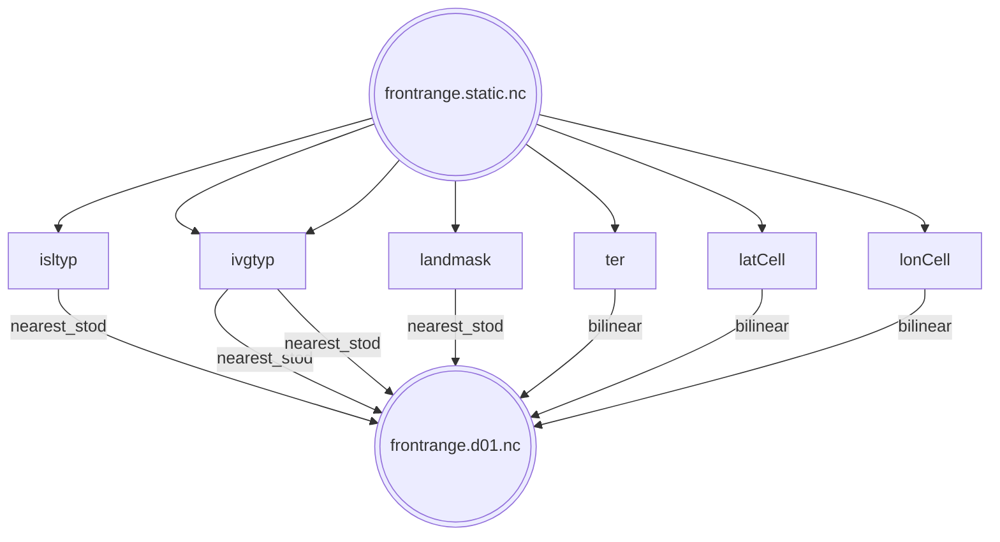

# MPAS-Hydro
MPAS-Hydro is a coupling of the [MPAS](https://github.com/MPAS-Dev/MPAS-Model) Atmosphere and [WRF-Hydro](https://github.com/NCAR/wrf_hydro_nwm_public).
The coupling mechanism uses [Earth System Modeling Framework](https://earthsystemmodeling.org/)
(ESMF) and the [National Unified Operational Prediction Capability](https://earthsystemmodeling.org/nuopc)
(NUOPC) interoperability layer, also reffered to as a cap.


## Build
MPAS-Hydro couples using the ESMX infrastructure.
Note, the build instructions are specific to Derecho at the current moment.

### Dependencies
- MPI
- Fortran NetCDF
- ParallelIO
- ESMF
- OpenBLAS
- CMake

#### Derecho Modules
Load appropriate set of modules, the following are for building with GNU.
```
$ ml purge
$ ml ncarenv/24.12 gcc/12.4.0 ncarcompilers cray-mpich cmake openblas parallelio
$ ml esmf/8.8.1 netcdf-mpi/4.9.3 parallel-netcdf hdf5-mpi
```


### Retrieve Code
```
Retrieve repository
$ git clone --branch mpas-hydro --recurse-submodules git@github.com:NCAR/mpas-hydro.git
$ cd mpas-model
```


### Build Instructions
```
$ AUTOCLEAN=true \
  PIO=${NCAR_ROOT_PARALLELIO} \
  PnetCDF_ROOT=${NCAR_ROOT_PARALLEL_NETCDF} \
  PnetCDF_MODULE_DIR=${NCAR_ROOT_PARALLEL_NETCDF}/include \
  USE_MPI_F08=0 \
  MPAS_HYDRO=true \
  ESMX_Builder -v --build-jobs=4 --build-type=Debug
```

The user can also use the provided `Makefile` in the top directory.
```
$ make
or
$ make build
```


## Run Instructions
Setup a case, one could download a [MPAS testcase](https://www2.mmm.ucar.edu/projects/mpas/test_cases/v7.0/).
Make sure that `esmxRun.yaml, init_atmosphere_model` and `mpas_hydro` are present in the directory.

```
Run initialization executable
$ ./init_atmosphere_model
Run MPAS Hydro
$ mpirun -np 4 ./mpas_hydro
```

## Visualize Output
### Requirements
- [UXarray](https://uxarray.readthedocs.io/en/latest/)
- [JupyterLab](https://jupyterlab.readthedocs.io/en/latest/)

```
$ conda create --prefix /path/to/conda_env/uxarray
$ conda activate uxarray
$ conda install -c conda-forge uxarray jupyterlab
```

### Visualization
Start JupyterLab
```
$ jupyter lab
```

Edit a jupyter notebook to have something similar the following
```
import uxarray as ux
uxds_orig = ux.open_dataset("x1.40962.grid.nc", "output.nc")
uxds = uxds_orig.isel(Time=0)
uxds.uxgrid = uxds_orig.uxgrid  # reattach grid after selection for time
uxds['ter'].plot()
```

## NUOPC Cap Exchange
- [ ] Add list of variables being exchanged for two and one way coupling


## Graphs
- [ ] create graphs of procedures, variables exchanged, data structures, process workflow


## Directory Structure
```
mpas-model/
├──src/
│   ├──hydro/
│   │   └──src/CPL/NUOPC_cpl/
│   ├──mpas/
│   │   └──src/
│   │       ├──core_atmosphere/couple/nuopc/
│   │       └──core_init_atmosphere/
│   └──noahmp/
│       ├──drivers/nuopc/
│       └──src/
└──test/
    └──testcases/
```

# Data Fields

## WRF-Hydro Input Fields from MPAS
Variables in file `src/core_atmosphere/physics/mpas_atmphys_vars.F` and the NoahMP variables are defined in
`src/core_atmosphere/physics/physics_noahmp/drivers/mpas/NoahmpIOVarType.F90`


|------------------------------------------------+-------------+--------------------------------+---------------------+----------------------------------|
| WRF-Hydro Variable Name                        | MPAS Name   | MPAS Desciption                | Units               | Regridding Method                |
|------------------------------------------------+-------------+--------------------------------+---------------------+----------------------------------|
| `inst_total_soil_moisture_content`             | ``          |                                |                     | `ESMF_REGRIDMETHOD_BILINEAR`     |
| `inst_soil_moisture_content`                   | ``          |                                |                     | `ESMF_REGRIDMETHOD_BILINEAR`     |
| `inst_soil_temperature`                        | ``          |                                |                     | `ESMF_REGRIDMETHOD_BILINEAR`     |
| `liquid_fraction_of_soil_moisture_layer_{1-4}` | `sh2o_p`    | unfrozed soil moisture content | volumetric fraction | `ESMF_REGRIDMETHOD_BILINEAR`     |
| `soil_column_drainage`                         | ``          |                                |                     |                                  |
| `soil_moisture_fraction_layer_{1-4}`           | `smois_p`   | soil moisture                  | volumetric fraction | `ESMF_REGRIDMETHOD_BILINEAR`     |
| `soil_porosity`                                | `smcmax1`   |                                |                     | `ESMF_REGRIDMETHOD_BILINEAR`     |
| `soil_temperature_layer_{1-4}`                 | `tslb_p`    | soil temperature               | K                   | `ESMF_REGRIDMETHOD_BILINEAR`     |
| `subsurface_runoff_accumulated`                | `udrunoff`  |                                |                     | `ESMF_REGRIDMETHOD_BILINEAR`     |
| `surface_runoff_accumulated`                   | `sfcrunoff` |                                |                     | `ESMF_REGRIDMETHOD_BILINEAR`     |
| `surface_water_depth`                          | `sfchead`   |                                |                     | `ESMF_REGRIDMETHOD_BILINEAR`     |
| `time_step_infiltration_excess`                | `soldrain`  |                                |                     | `ESMF_REGRIDMETHOD_BILINEAR`     |
| `vegetation_type`                              | `vegtyp`    |                                |                     | `ESMF_REGRIDMETHOD_NEAREST_STOD` |
|------------------------------------------------+-------------+--------------------------------+---------------------+----------------------------------|


Variables needed

|-----------------------|------------------|---------------------------------------|-------|
| WRF-Hydro Name        | MPAS NoahMP Name | Desciption                            | Units |
|-----------------------|------------------|---------------------------------------|-------|
| `smc` or `smc{1-4}`   | `smois`          | total soil moisture content, 4 layers |       |
| `slc` or `sh2ox{1-4}` | `sh2o`           | liquid soil moisture content          |       |
| `stc` or `stc{1-4}`   | `tslb`           | soil temperature                      | K     |
| `infxsrt`             | ``               | infiltration excess                   |       |
| `soldrain`            | ``               | soil drainage                         |       |
|-----------------------|------------------|---------------------------------------|-------|

|------------------|-----------------------------------------|------|
| MPAS NoahMP Name | Description                             | Dims |
|------------------|-----------------------------------------|------|
| smoiseq          | volumetric soil moisture [m3/m3]        | 2    |
| smois            | volumetric soil moisture [m3/m3]        | 2    |
| sh2o             | volumetric liquid soil moisture [m3/m3] | 2    |
| tslb             | soil temperature [K]                    | 2    |
|                  |                                         |      |
|------------------|-----------------------------------------|------|


## Geogrid File Creation from MPAS + NoahMP
The geogrid file is created at runtime by using importing variables from MPAS

| MPAS Variable | description                 | Hydro Geo Var | description                   | Regrid Method |
|---------------|-----------------------------|---------------|-------------------------------|---------------|
| isltyp        | soil type index             | SCT_DOM       | Dominant top layer soil class | Nearest Stod  |
| ivgtyp        | vegetation type index       | VEGTYP        | Vegetation type               | Nearest Stod  |
| ivgtyp        | vegetation type index       | LU\_INDEX     | Land cover type               | Nearest Stod  |
| landmask      |                             | LANDMASK      |                               | Nearest Stod  |
| ter           | terrain height, in .init.nc | HGT\_M        | Elevation                     | Bilinear      |
| latCell       | Latitude                    | XLAT\_M       | Latitude                      | Bilinear      |
| lonCell       | Longitude                   | XLONG\_M      | Longitude                     | Bilinear      |






# Tutorial
## Running Front Range Case
Front Range, CO (70.2 MB)

```
Setup Testcase
$ wget https://github.com/NCAR/wrf_hydro_nwm_public/releases/download/v5.4.0/front_range_CO_example_testcase_coupled.tar.gz
$ tar zxf front_range_CO_example_testcase_coupled.tar.gz
$ cd example_case_coupled
$ TODO: FILL IN MPAS INFO

Partition with METIS where np is equal to the number or MPI processes to use
$ gpmetis -niter=200 frontrange.graph.info [np]
```


## Running Idealized Case
Following instructions from [MPAS Tutorial 2024](https://www2.mmm.ucar.edu/projects/mpas/tutorial/Howard2024/index.html)


```
JW Baroclinic for now, Front Range, CO in the Future

Setup Testcase
$ wget https://www2.mmm.ucar.edu/projects/mpas/test_cases/v7.0/jw_baroclinic_wave.tar.gz
$ tar zxf jw_baroclinic_wave.tar.gz
$ cd jw_baroclinic_wave/* .


Symlink the executables
$ ln -s ../install/bin/init_atmosphere_model .
$ ln -s ../install/bin/mpas_hydro

Run, choose an np such that the file frontrange.graph.info.part.{np} exists
Note, frontrange is small enough to run in serial, without MPI
$ mpiexec -np 4 ./init_atmosphere_model
$ mpiexec -np 4 ./mpas_hydro
```
