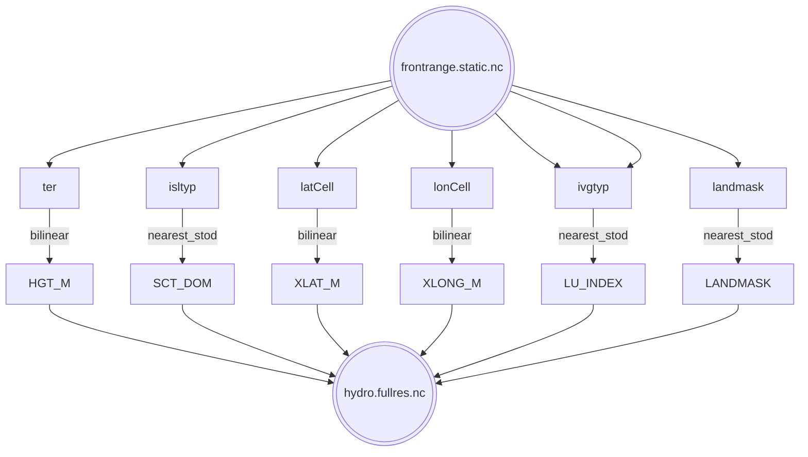
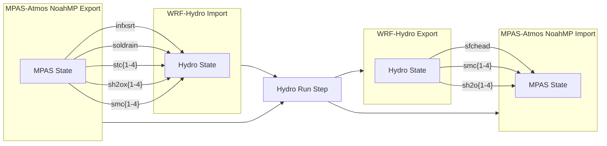

# MPAS-Hydro
MPAS-Hydro is a coupling of the [MPAS](https://github.com/MPAS-Dev/MPAS-Model) Atmosphere and [WRF-Hydro](https://github.com/NCAR/wrf_hydro_nwm_public).
The coupling mechanism uses [Earth System Modeling Framework](https://earthsystemmodeling.org/)
(ESMF) and the [National Unified Operational Prediction Capability](https://earthsystemmodeling.org/nuopc)
(NUOPC) interoperability layer, also reffered to as a cap.


## Build
MPAS-Hydro couples using the ESMX infrastructure.
Note, the build instructions are specific to Derecho at the current moment.

### Dependencies
- MPI
- Fortran NetCDF
- ParallelIO
- ESMF: (ESMF Build Instructions)[#ESMF-Build-Instructions]
- OpenBLAS
- CMake

#### Derecho Modules
Load appropriate set of modules, the following are for building with GNU.
```
$ ml purge
$ ml ncarenv/24.12 gcc/12.4.0 ncarcompilers cray-mpich cmake openblas parallelio
$ ml esmf/8.8.1 netcdf-mpi/4.9.3 parallel-netcdf hdf5-mpi
```

### Retrieve Code
```
Retrieve repository
$ git clone --branch mpas-hydro --recurse-submodules git@github.com:NCAR/mpas-hydro.git
$ cd mpas-model
```


### Build Instructions
```
$ AUTOCLEAN=true \
  PIO=${NCAR_ROOT_PARALLELIO} \
  PnetCDF_ROOT=${NCAR_ROOT_PARALLEL_NETCDF} \
  PnetCDF_MODULE_DIR=${NCAR_ROOT_PARALLEL_NETCDF}/include \
  USE_MPI_F08=0 \
  MPAS_HYDRO=true \
  ESMX_Builder -v --build-jobs=4 --build-type=Debug
```

The user can also use the provided `Makefile` in the top directory.
```
$ make
or
$ make build
```


## Preprocessing Steps
### NoahMP Files
The NoahMP in MPAS is the refactored version and requires the refactored `NoahmpTable.TBL` version.
The [MPTABLE.TBL](https://github.com/NCAR/wrf_hydro_nwm_public/blob/main/src/Land_models/NoahMP/run/MPTABLE.TBL)
from the WRF-Hydro repository will not work.
Variables like `LOW_DENSITY_RESIDENTIAL` and an urban Local Climate Zone (LCZ) classification scheme.
It would need to be renamed `NoahmpTable.TBL` and even then will lead to `Fortran runtime error: End of file` errors.

### METIS
Build [Metis](https://github.com/KarypisLab/METIS), it will install in `$HOME/local`
METIS takes the testcase.graph.info file which has all the grid information, and decides
  how to split a mesh node between np partitions.

#### Build METIS
```
# Build Dependecy GKlib
$ cd ${RUN_DIRECTORY}
$ git clone git@github.com:KarypisLab/GKlib.git gklib
$ cd gklib
$ make config
$ make -j 4
$ make install

# Build metis
$ cd ${RUN_DIRECTORY}
$ git clone git@github.com:KarypisLab/METIS.git metis
$ cd metis
$ make config gklib_path=$HOME/local/lib64
$ make -j 4
$ make install
```

#### Run METIS
Run Metis to create `np` partitions where `np` is the number of processes used to run MPI.
```
$ cd ${RUN_DIRECTORY}
$ gpmetis -ptype=kway -contig -minconn -ufactor=1 frontrange.graph.info ${np}
```


### SCRIP
ESMF cannot currently read the native MPAS mesh format.
The MPAS mesh file needs to be converted to SCRIP format so ESMF can easily read the mesh to regrid.

#### Build SCRIP
```
$ conda activate mpas_tools
$ conda install -c conda-forge mpas_tools
```
#### Run SCRIP
```
$ scrip_from_mpas -m testcase.grid.nc -s testcase.scrip.nc
```


## Run Instructions
<!-- Setup a case, one could download a [MPAS testcase](https://www2.mmm.ucar.edu/projects/mpas/test_cases/v7.0/). -->
<!-- Make sure that `esmxRun.yaml, init_atmosphere_model` and `mpas_hydro` are present in the directory. -->

<!-- ``` -->
<!-- Run initialization executable -->
<!-- $ ./init_atmosphere_model -->
<!-- Run MPAS Hydro -->
<!-- $ mpirun -np 4 ./mpas_hydro -->
<!-- ``` -->

- Setup testcase

- Edit the following files to have the same start date
  - esmxRun.yaml
  - namelist.atmosphere
  - hydro.namelist


- NOTE: the first time running a case, run with `-np 1` so `hydro.fullres.nc` will be created.

```bash
# Run with np=1 first to create hydro.fullres.nc
$ LD_LIBRARY_PATH=/path/to/src/build/install/lib64/:${LD_LIBRARY_PATH} \
    mpirun -np 1 ./mpas_hydro
$ LD_LIBRARY_PATH=/path/to/src/build/install/lib64/:${LD_LIBRARY_PATH} \
    mpirun -np 4 ./mpas_hydro
```

### Restarts
To restart the models the following options will need to be updated
- `esmxRun.yaml`
  - `startTime: 2011-09-10T06:00:00` under `App`
- `atmosphere.namelist`
  - `config_start_time = '2013-09-10_06:00:00'` under `&nhyyd_model`
  - `config_do_restart = true` under `&restart`
- `hydro.namelist`
  - `RESTART_FILE = 'HYDRO_RST.2011-09-10_06:00_DOMAIN2'` under `&HYDRO_nlist`


## Visualize Output
### Requirements
- [UXarray](https://uxarray.readthedocs.io/en/latest/)
- [JupyterLab](https://jupyterlab.readthedocs.io/en/latest/)

```
$ conda create --prefix /path/to/conda_env/uxarray
$ conda activate uxarray
$ conda install -c conda-forge uxarray jupyterlab
```

### Visualization
The xarray extension [UXarray](https://uxarray.readthedocs.io/en/latest/index.html) is used to visualize the MPAS meshes.
Follow the instructions to [install uxarray](https://uxarray.readthedocs.io/en/latest/getting-started/installation.html)
or if the user is on Derecho they can use an NPL library.
The following commands are specifically for use within a Jupyter notebook.

#### Basic Mesh Plotting
```python
import uxarray as ux
uxds_orig = ux.open_dataset("x1.40962.grid.nc", "output.nc")
uxds = uxds_orig.isel(Time=0)
uxds.uxgrid = uxds_orig.uxgrid  # reattach grid after selection for time
uxds['ter'].plot()

mesh_grid = 'frontrange.grid.nc'
mesh_file = 'history.2013-09-10_00.00.00.nc' # or any mesh file
ux.open_dataset(mesh_grid, mesh_file, decode_times=False,
                grid_kwargs={"decode_times": False, "drop_variables": ["Time"]},)
mpas['ter'].isel(Time=0).plot()
```
The simplest way is to use `.plot()`.
In a Jupyter notebook, only the last expression in a cell is auto-displayed.
If there are multiple plot statements adding `display()` is needed on all but the last.

```python
display(mpas['smois'].plot())
mpas['isltyp'].plot()
```

The `.plot()` will return a plot object that can be used later.
This is extremely usefull for plotting meshes side-by-side with the `(p1 + p2)` statement.

```python
p1 = mpas['vegfra'].isel(Time=0, drop=True).plot()
p2 = mpas['isltyp'].plot(cmap='tab20')
(p1 + p2)
```

If the width of the plots is too wide, they can be reduced by passing arguments to opts.

```python
p = 0.7
w = int(p1.opts["width"] * p)
h = int(p1.opts["height"] * p)
(p1.opts(width=w, height=h) + p2.opts(width=w, height=h) + p3.opts(width=w, height=h))
```
Plot a mesh cutout over the hydro domain
```python
hydro_dom = xr.open_dataset(dir + 'Fulldom_hires.nc')
lon_min = float(hydro_dom['LONGITUDE'][0, :].min())
lon_max = float(hydro_dom['LONGITUDE'][0, :].max())
lat_min = float(hydro_dom['LATITUDE'][:, 0].min())
lat_max = float(hydro_dom['LATITUDE'][:, 0].max())
lon_bounds = (lon_min, lon_max)
lat_bounds = (lat_min, lat_max)
mpas['sfcheadrt'].subset.bounding_box(lon_bounds=lon_bounds, lat_bounds=lat_bounds).plot()

```


#### Geotiff
The following code show how to export a variable to geotiff formst.
```python
import cartopy.crs as ccrs
import matplotlib.pyplot as plt
import numpy as np
import rasterio
from rasterio.transform import from_bounds
import uxarray as ux

# --- Open mesh and read lat/lon bounds ---
dir = '/glade/derecho/scratch/soren/src/wrf-hydro/mpas_testcases/front_range_CO_noahmp_1km/'
f = dir + '2way_2hr_1np/history.2013-09-10_00.00.00.nc'
mpas = ux.open_dataset(dir+"frontrange.grid.nc", f,
                    decode_times=False, grid_kwargs={"decode_times": False, "drop_variables": ["Time"]},)

lon = mpas.uxgrid.face_lon.values
lat = mpas.uxgrid.face_lat.values
lon_min, lon_max = lon.min(), lon.max()
lat_min, lat_max = lat.min(), lat.max()

# --- read variable as raster and plot ---
var = 'sfcheadrt'
fig, ax = plt.subplots(subplot_kw={"projection": ccrs.Robinson()})
ax.set_extent([lon_min, lon_max, lat_min, lat_max],
              crs=ccrs.PlateCarree())
raster = mpas['isltyp'].to_raster(ax=ax)
ny, nx = raster.shape
transform = from_bounds(lon_min, lat_min, lon_max, lat_max, nx, ny)
ax.imshow(raster, origin="lower", extent=ax.get_xlim() + ax.get_ylim())

# --- write geotiff file ---
with rasterio.open(
    dir+'frontrange.tif',
    "w",
    driver="GTiff",
    height=ny,
    width=nx,
    count=1,
    dtype="float32",
    crs="EPSG:4326",
    transform=transform,
    nodata=np.nan,
    compress="deflate",
) as dst:
    dst.write(raster, 1)
```


## NUOPC Cap Exchange
- [ ] Add list of variables being exchanged for two and one way coupling


## Graphs
- [ ] create graphs of procedures, variables exchanged, data structures, process workflow


## Directory Structure
```
mpas-model/
├──src/
│   ├──hydro/
│   │   └──src/CPL/NUOPC_cpl/
│   ├──mpas/
│   │   └──src/
│   │       ├──core_atmosphere/couple/nuopc/
│   │       └──core_init_atmosphere/
│   └──noahmp/
│       ├──drivers/nuopc/
│       └──src/
└──test/
    └──testcases/
```

# Data Fields

## WRF-Hydro Input Fields from MPAS
Variables in file `src/core_atmosphere/physics/mpas_atmphys_vars.F` and the NoahMP variables are defined in
`src/core_atmosphere/physics/physics_noahmp/drivers/mpas/NoahmpIOVarType.F90`


| WRF-Hydro Variable Name                        | MPAS Name   | MPAS Desciption                | Units               | Regridding Method                |
|------------------------------------------------|-------------|--------------------------------|---------------------|----------------------------------|
| `inst_total_soil_moisture_content`             | ``          |                                |                     | `ESMF_REGRIDMETHOD_BILINEAR`     |
| `inst_soil_moisture_content`                   | ``          |                                |                     | `ESMF_REGRIDMETHOD_BILINEAR`     |
| `inst_soil_temperature`                        | ``          |                                |                     | `ESMF_REGRIDMETHOD_BILINEAR`     |
| `liquid_fraction_of_soil_moisture_layer_{1-4}` | `sh2o_p`    | unfrozed soil moisture content | volumetric fraction | `ESMF_REGRIDMETHOD_BILINEAR`     |
| `soil_column_drainage`                         | ``          |                                |                     |                                  |
| `soil_moisture_fraction_layer_{1-4}`           | `smois_p`   | soil moisture                  | volumetric fraction | `ESMF_REGRIDMETHOD_BILINEAR`     |
| `soil_porosity`                                | `smcmax1`   |                                |                     | `ESMF_REGRIDMETHOD_BILINEAR`     |
| `soil_temperature_layer_{1-4}`                 | `tslb_p`    | soil temperature               | K                   | `ESMF_REGRIDMETHOD_BILINEAR`     |
| `subsurface_runoff_accumulated`                | `udrunoff`  |                                |                     | `ESMF_REGRIDMETHOD_BILINEAR`     |
| `surface_runoff_accumulated`                   | `sfcrunoff` |                                |                     | `ESMF_REGRIDMETHOD_BILINEAR`     |
| `surface_water_depth`                          | `sfchead`   |                                |                     | `ESMF_REGRIDMETHOD_BILINEAR`     |
| `time_step_infiltration_excess`                | `soldrain`  |                                |                     | `ESMF_REGRIDMETHOD_BILINEAR`     |
| `vegetation_type`                              | `lu_index`  |                                |                     | `ESMF_REGRIDMETHOD_NEAREST_STOD` |


Variables needed

| WRF-Hydro Name        | MPAS NoahMP Name | Desciption                            | Units |
|-----------------------|------------------|---------------------------------------|-------|
| `smc` or `smc{1-4}`   | `smois`          | total soil moisture content, 4 layers |       |
| `slc` or `sh2ox{1-4}` | `sh2o`           | liquid soil moisture content          |       |
| `stc` or `stc{1-4}`   | `tslb`           | soil temperature                      | K     |
| `infxsrt`             |                  | infiltration excess                   |       |
| `soldrain`            |                  | soil drainage                         |       |


| MPAS NoahMP Name | Description                             | NoahMP Dim | MPAS Dim |
|------------------|-----------------------------------------|------------|----------|
| smoiseq          | volumetric soil moisture [m3/m3]        | 2          | 1        |
| smois            | volumetric soil moisture [m3/m3]        | 2          |          |
| sh2o             | volumetric liquid soil moisture [m3/m3] | 2          |          |
| tslb             | soil temperature [K]                    | 2          |          |
| sfcrunoff        | surface runoff [mm]                     |            |          |


## Geogrid File Creation from MPAS + NoahMP
The geogrid `hydro.fullres.nc` file is created at runtime by using importing variables from MPAS

| MPAS Variable | description                 | Hydro Geo Var | description                   | Regrid Method |
|---------------|-----------------------------|---------------|-------------------------------|---------------|
| isltyp        | soil type index             | SCT_DOM       | Dominant top layer soil class | Nearest Stod  |
| ivgtyp        | vegetation type index       | LU\_INDEX     | Land cover type               | Nearest Stod  |
| landmask      |                             | LANDMASK      |                               | Nearest Stod  |
| ter           | terrain height, in .init.nc | HGT\_M        | Elevation                     | Bilinear      |
| latCell       | Latitude                    | XLAT\_M       | Latitude                      | Bilinear      |
| lonCell       | Longitude                   | XLONG\_M      | Longitude                     | Bilinear      |



```mermaid
flowchart TD
  frontrange(((frontrange.static.nc)))
  d01(((hydro.fullres.nc)))
  frontrange --> isltyp
  frontrange --> ivgtyp
  frontrange --> ivgtyp
  frontrange --> landmask
  frontrange --> ter
  frontrange --> latCell
  frontrange --> lonCell

  isltyp -- nearest_stod --> SCT_DOM
  ivgtyp -- nearest_stod --> LU_INDEX
  landmask -- nearest_stod --> LANDMASK
  ter -- bilinear --> HGT_M
  latCell -- bilinear --> XLAT_M
  lonCell -- bilinear --> XLONG_M

  HGT_M --> d01
  SCT_DOM --> d01
  XLAT_M --> d01
  XLONG_M --> d01
  LU_INDEX --> d01
  LANDMASK --> d01

```


### Hydro Timestep Regridding Graph

```mermaid
graph LR
  subgraph HYDRO_Import[WRF-Hydro Import]
    Hstate_Import[Hydro State]
  end

  subgraph MPAS_Export[MPAS-Atmos NoahMP Export]
    Mstate_Export[MPAS State]
  end

  HYDRO_Import --> Run
  MPAS_Export --> Run
  Run --> HYDRO
  Run --> MPAS
  Run[Hydro Run Step]

  %% export to hydro
  Mstate_Export -- "infxsrt" --> Hstate_Import
  Mstate_Export -- "soldrain" --> Hstate_Import
  Mstate_Export -- "stc{1-4}" --> Hstate_Import
  Mstate_Export -- "sh2ox{1-4}" --> Hstate_Import
  Mstate_Export -- "smc{1-4}" --> Hstate_Import

  %% ---------------------------------

  subgraph HYDRO[WRF-Hydro Export]
    Hstate[Hydro State]
  end

  subgraph MPAS[MPAS-Atmos NoahMP Import]
    Mstate[MPAS State]
  end

  %% export only
  Hstate -- "sfchead" --> Mstate
  %% import and export
  Hstate --> |"smc{1-4}" | Mstate
  Hstate --> |"sh2o{1-4}"| Mstate
```


# Tutorial
## Running Front Range Case
Front Range, CO (70.2 MB)

```
Setup Testcase
$ wget https://github.com/NCAR/wrf_hydro_nwm_public/releases/download/v5.4.0/front_range_CO_example_testcase_coupled.tar.gz
$ tar zxf front_range_CO_example_testcase_coupled.tar.gz
$ cd example_case_coupled
$ TODO: FILL IN MPAS INFO

Partition with METIS where np is equal to the number or MPI processes to use
$ gpmetis -niter=200 frontrange.graph.info [np]
```


## Running Idealized Case
Following instructions from [MPAS Tutorial 2024](https://www2.mmm.ucar.edu/projects/mpas/tutorial/Howard2024/index.html)


```
JW Baroclinic for now, Front Range, CO in the Future

Setup Testcase
$ wget https://www2.mmm.ucar.edu/projects/mpas/test_cases/v7.0/jw_baroclinic_wave.tar.gz
$ tar zxf jw_baroclinic_wave.tar.gz
$ cd jw_baroclinic_wave/* .


Symlink the executables
$ ln -s ../install/bin/init_atmosphere_model .
$ ln -s ../install/bin/mpas_hydro

Run, choose an np such that the file frontrange.graph.info.part.{np} exists
Note, frontrange is small enough to run in serial, without MPI
$ mpiexec -np 4 ./init_atmosphere_model
$ mpiexec -np 4 ./mpas_hydro
```

# Miscellaneous Instructions
## ESMF Build Instructions
Edit `ESMF_INSTALL_PREFIX` to change the install path.
```
$ wget https://github.com/esmf-org/esmf/archive/refs/tags/v8.8.1.tar.gz
$ tar zxf v8.8.1.tar.gz
$ cd esmf-8.8.1
$ export \
  ESMF_COMM=openmpi \
  ESMF_BOPT=O \
  ESMF_COMPILER=gfortran \
  ESMF_OS=Linux \
  ESMF_NETCDF=nc-config \
  ESMF_INSTALL_MODDIR=mod \
  ESMF_INSTALL_BINDIR=bin \
  ESMF_INSTALL_LIBDIR=lib \
  ESMF_DIR=$(pwd)
$ make -j 4
$ make install
```
